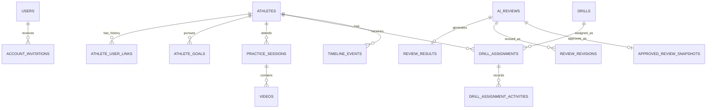

# Database ER Diagram

## Entity Relationship Diagram

The diagram groups service-owned entities for domain understanding. It does not imply cross-service foreign keys. `ATHLETE_USER_LINKS.auth_user_id`, media identifiers stored by AI Review Service, and source review identifiers stored by Athlete Service are external IDs.

## Users

Auth Service identity for coaches and invited athletes, including role and account status.

## Account Invitations

Auth Service hashed, expiring, single-use athlete password setup tokens.

## Athletes

Athlete profile, sport context, goals, and injury notes.

## Athlete User Links

Athlete Service link between a local athlete profile and an external Auth Service user ID.

## Practice Sessions

Training sessions associated with a coach and athlete.

## Videos

Video metadata and storage references.

## AI Observations

Structured AI-generated review details.

## Coach Reviews

Coach revisions, approvals, rejections, immutable snapshots, and final athlete visibility.

## Drills

Reusable training activities.

## Assignments

Drills assigned to athletes with status, due dates, progress, target snapshots, and actor-aware activity.

## Timeline Events

Chronological record of athlete activity and feedback.
