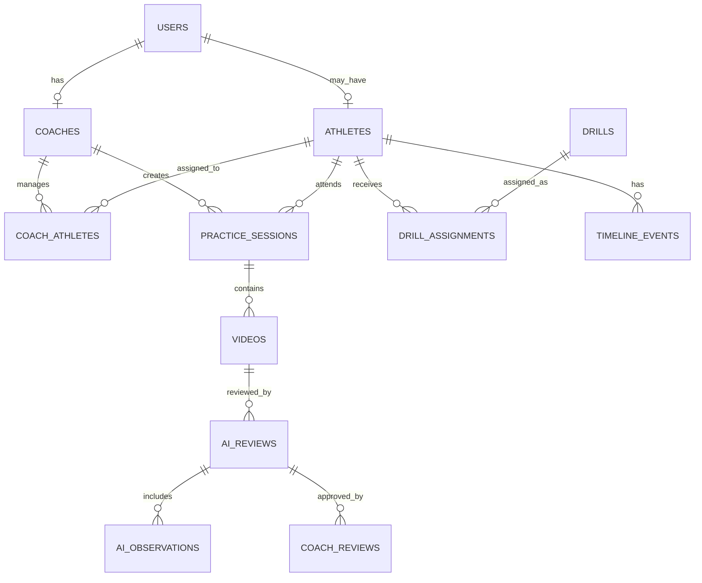

# Database ER Diagram

## Entity Relationship Diagram

## Users

Authentication identity for coaches and future athletes.

## Coaches

Coach profile linked to a user account.

## Athletes

Athlete profile, sport context, goals, and injury notes.

## Practice Sessions

Training sessions associated with a coach and athlete.

## Videos

Video metadata and storage references.

## AI Observations

Structured AI-generated review details.

## Coach Reviews

Coach edits, approvals, rejections, and final feedback.

## Drills

Reusable training activities.

## Assignments

Drills assigned to athletes with status and due dates.

## Timeline Events

Chronological record of athlete activity and feedback.
