# Service Interactions

## Login Flow

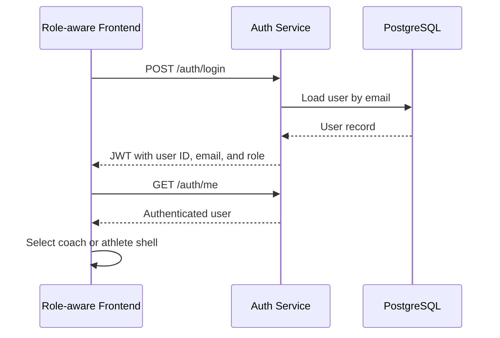

## Coach Invites Athlete

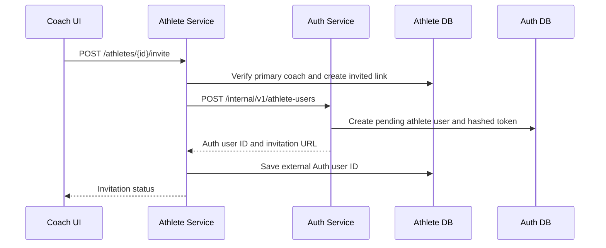

## Athlete Accepts Invitation

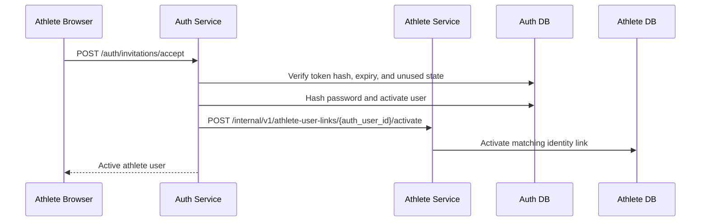

## Athlete Login And Profile Resolution

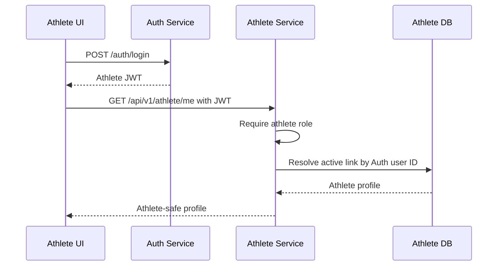

## Athlete Dashboard

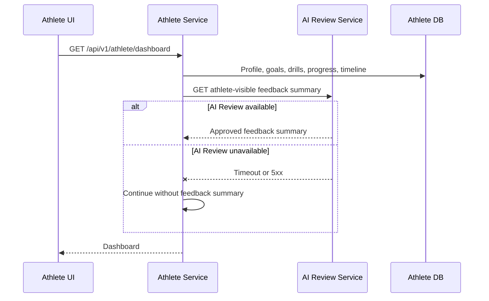

## Athlete Reads Approved Feedback

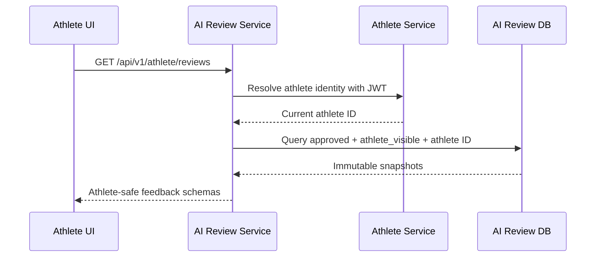

## Athlete Starts And Completes Drill

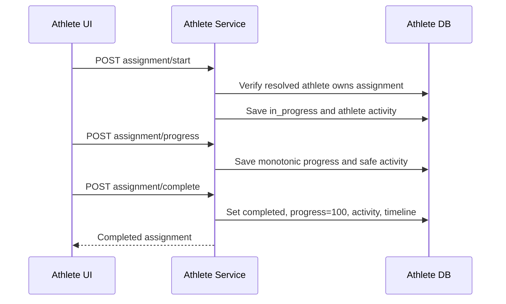

## Athlete Timeline

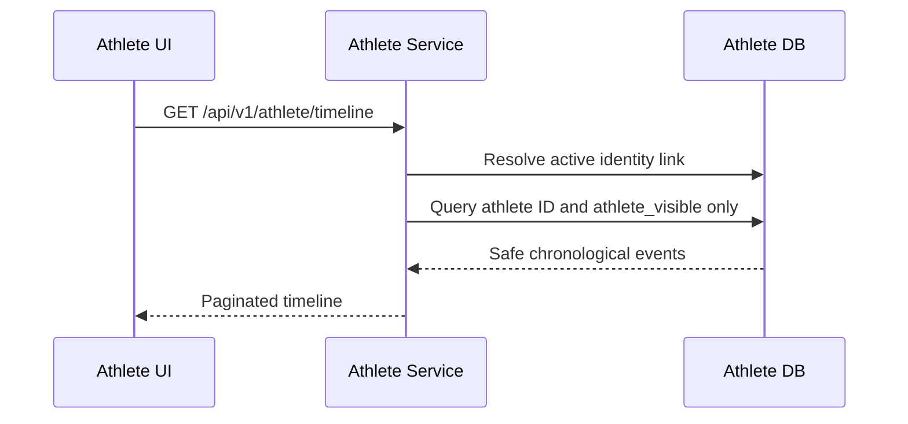

## Revision And Approval Flow

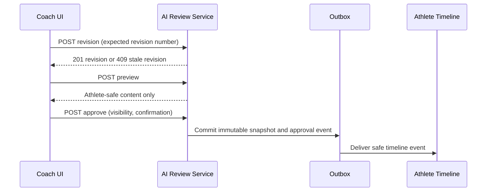

## Athlete Creation Flow

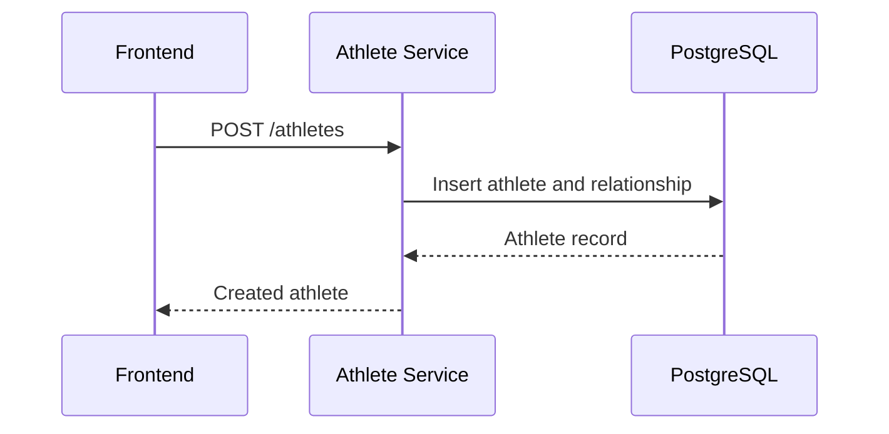

## Video Upload Flow

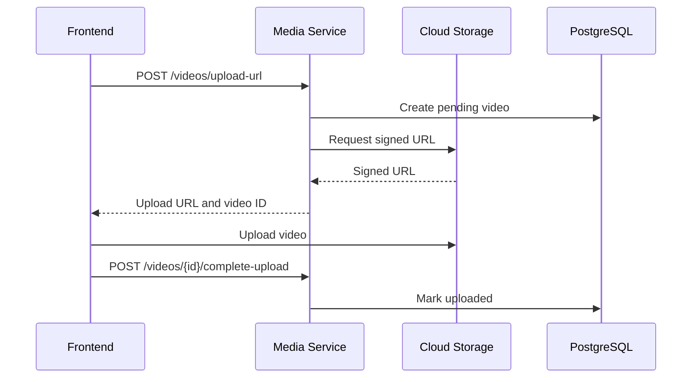

## AI Review Flow

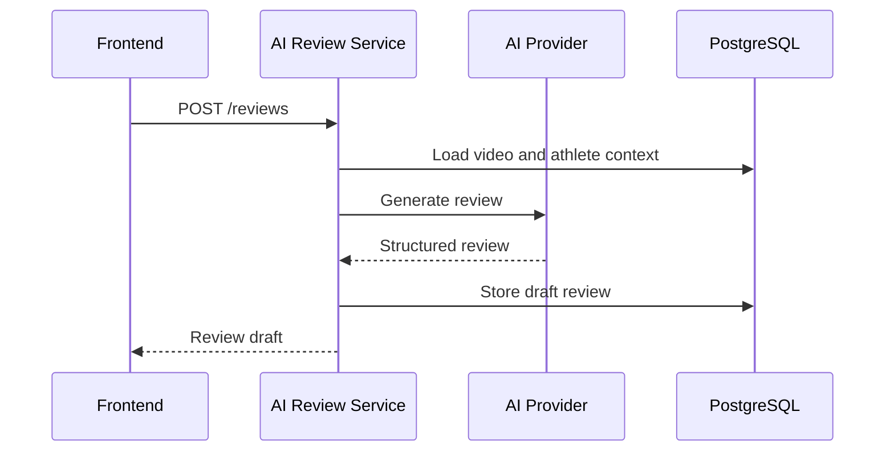

## Coach Approval Flow

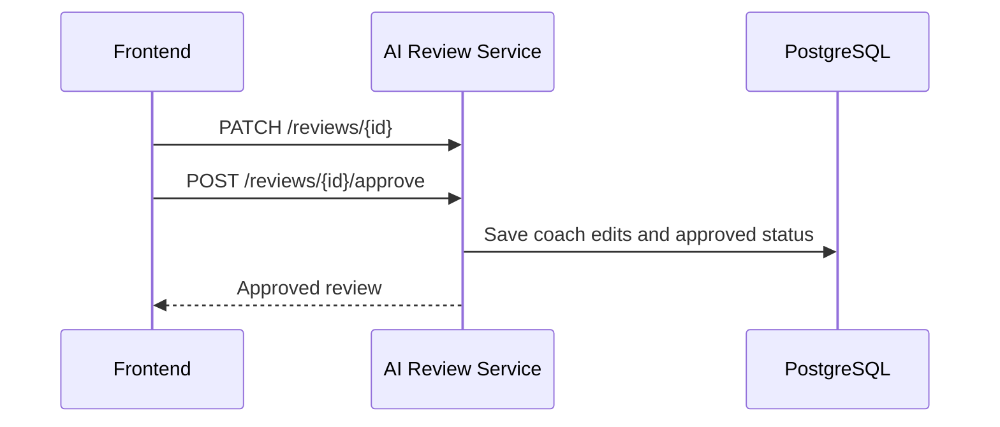

## Drill Assignment Flow

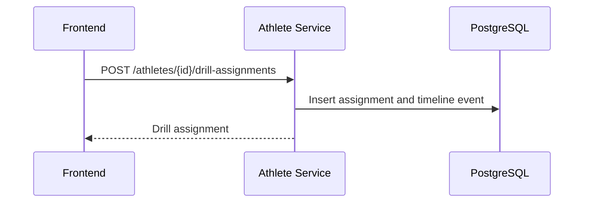

## Assign From Library

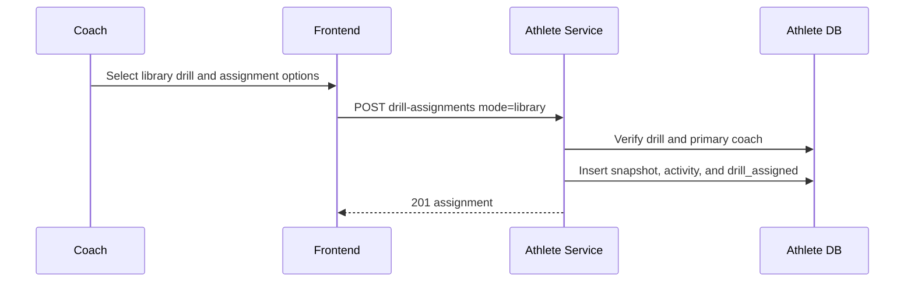

## Assign Approved Recommendation

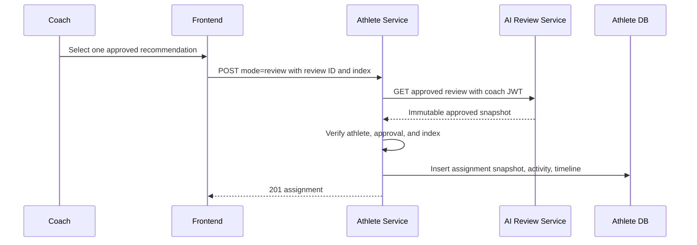

## Save Recommendation To Library

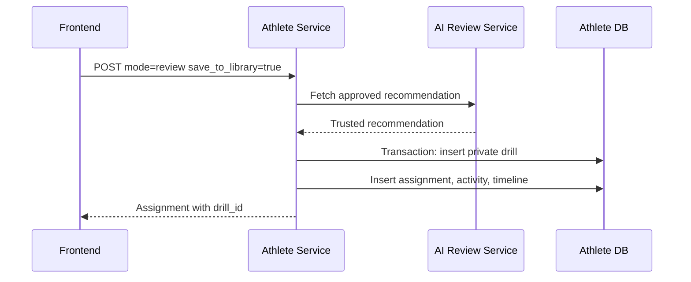

## Complete Assignment

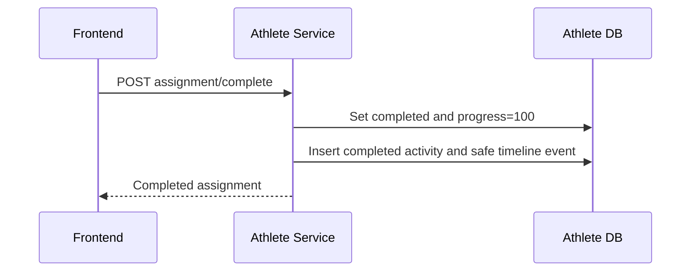

## Cancel Assignment

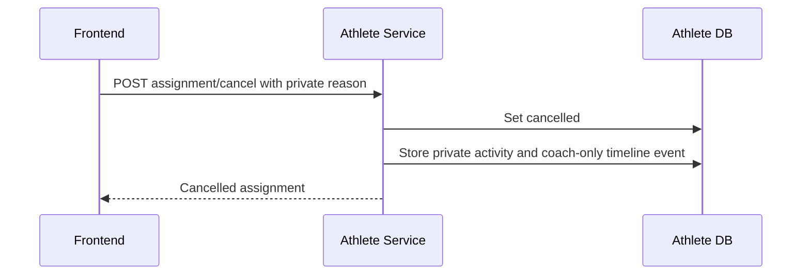
# Timeline Delivery

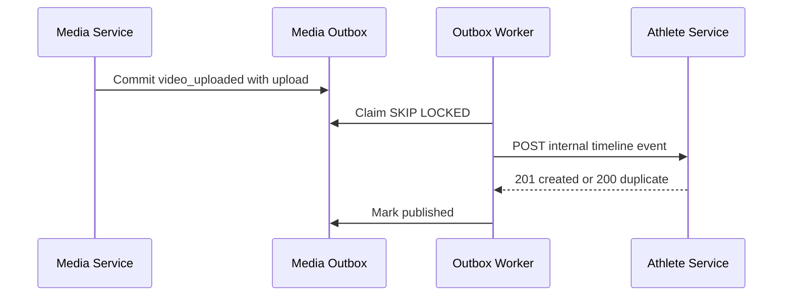

```mermaid
sequenceDiagram
  participant AI as AI Review Service
  participant O as AI Outbox
  participant A as Athlete Service
  AI->>O: Commit coach_review_approved
  O->>A: Publish athlete-visible event
  A-->>O: Idempotent success
```

```mermaid
sequenceDiagram
  participant W as Worker
  participant A as Athlete Service
  participant O as Outbox
  W-xA: Timeout or 5xx
  W->>O: Increment attempt and schedule backoff
  W->>A: Retry same event_id
```

## Athlete Progress Insight Request

```mermaid
sequenceDiagram
  participant UI as Coach Frontend
  participant Athlete as Athlete Service
  participant AI as AI Review Service
  participant Media as Media Service
  participant DB as Athlete DB
  UI->>Athlete: GET athlete insights with range and compare
  Athlete->>Athlete: Verify coach-athlete access and UTC boundaries
  Athlete->>DB: Load grouped drills, goals, activities, timeline
  par Safe upstream summaries
    Athlete->>AI: Approved review insight request
    Athlete->>Media: Practice and upload activity request
  end
  Athlete->>Athlete: Calculate metrics, trends, recurrence, flags
  Athlete-->>UI: Combined response with completeness
```

## Coach-Wide Progress Insight Request

```mermaid
sequenceDiagram
  participant UI as Coach Frontend
  participant Athlete as Athlete Service
  participant AI as AI Review Service
  participant Media as Media Service
  UI->>Athlete: GET coach insights
  Athlete->>Athlete: Resolve current coach athlete IDs
  Athlete->>AI: POST bounded approved-review batch
  Athlete->>Media: POST bounded activity batch
  Athlete->>Athlete: Aggregate without ranking or scoring
  Athlete-->>UI: Overview and attention preview
```

If AI Review or Media times out, Athlete Service keeps local drill and goal results, suppresses dependent flags, and returns `partial: true` with a safe warning code. It does not expose raw exceptions or retry one request per athlete.
