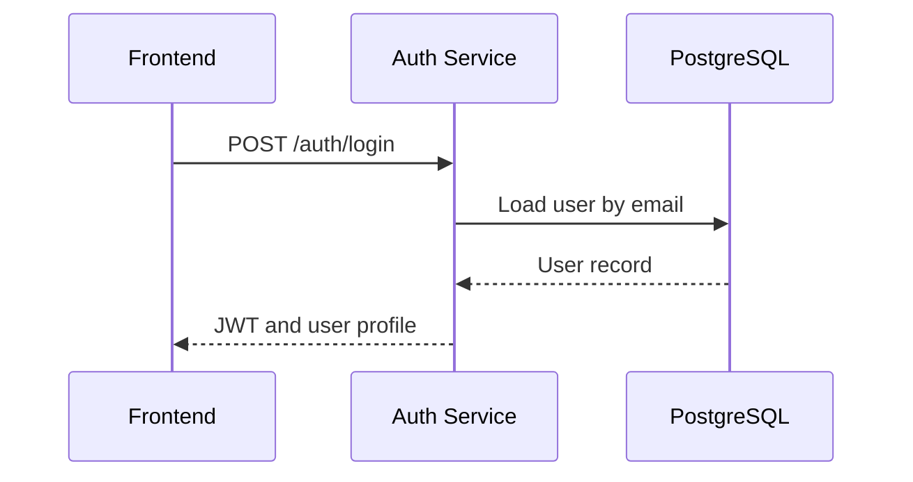
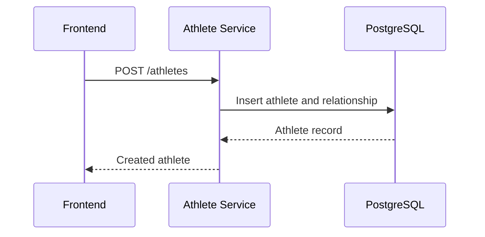
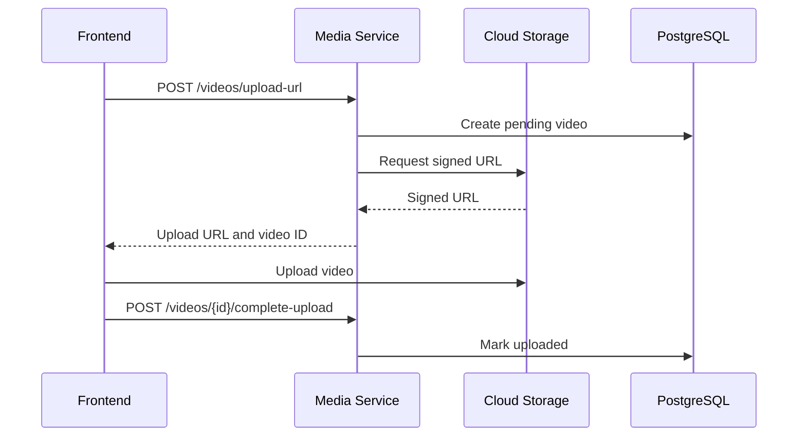
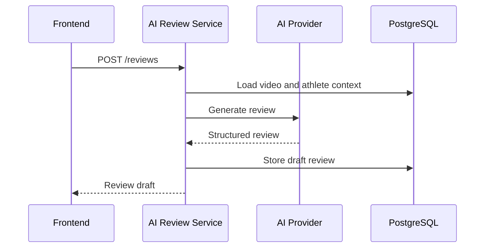
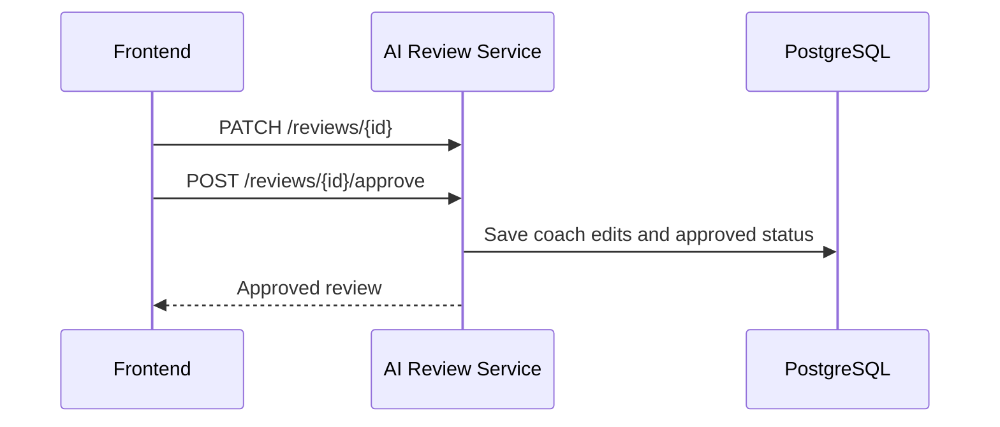
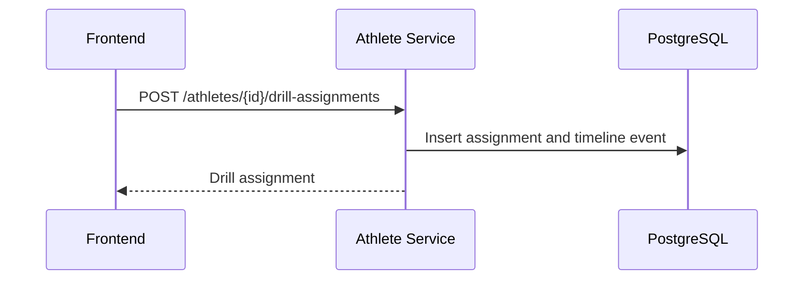
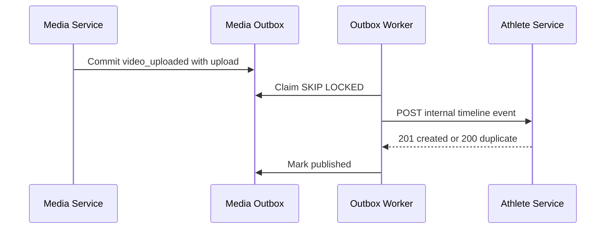
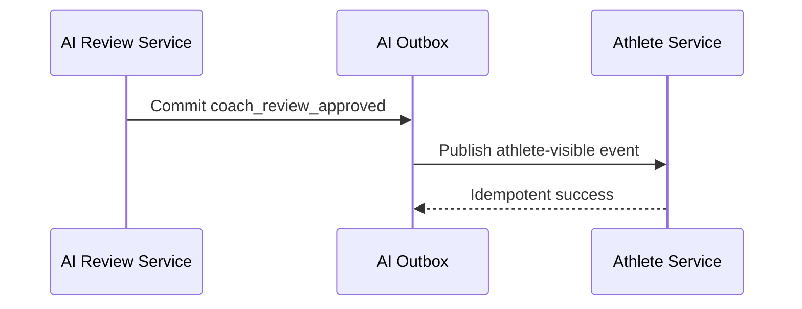
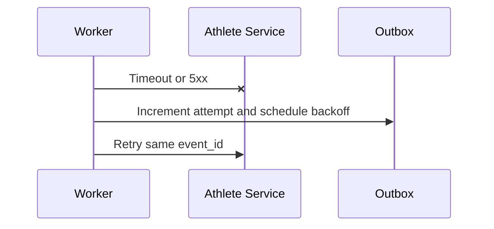

# Service Interactions

## Login Flow

```mermaid
sequenceDiagram
  participant UI as Frontend
  participant Auth as Auth Service
  participant DB as PostgreSQL
  UI->>Auth: POST /auth/login
  Auth->>DB: Load user by email
  DB-->>Auth: User record
  Auth-->>UI: JWT and user profile
```

## Athlete Creation Flow

```mermaid
sequenceDiagram
  participant UI as Frontend
  participant Athlete as Athlete Service
  participant DB as PostgreSQL
  UI->>Athlete: POST /athletes
  Athlete->>DB: Insert athlete and relationship
  DB-->>Athlete: Athlete record
  Athlete-->>UI: Created athlete
```

## Video Upload Flow

```mermaid
sequenceDiagram
  participant UI as Frontend
  participant Media as Media Service
  participant Storage as Cloud Storage
  participant DB as PostgreSQL
  UI->>Media: POST /videos/upload-url
  Media->>DB: Create pending video
  Media->>Storage: Request signed URL
  Storage-->>Media: Signed URL
  Media-->>UI: Upload URL and video ID
  UI->>Storage: Upload video
  UI->>Media: POST /videos/{id}/complete-upload
  Media->>DB: Mark uploaded
```

## AI Review Flow

```mermaid
sequenceDiagram
  participant UI as Frontend
  participant AI as AI Review Service
  participant Provider as AI Provider
  participant DB as PostgreSQL
  UI->>AI: POST /reviews
  AI->>DB: Load video and athlete context
  AI->>Provider: Generate review
  Provider-->>AI: Structured review
  AI->>DB: Store draft review
  AI-->>UI: Review draft
```

## Coach Approval Flow

```mermaid
sequenceDiagram
  participant UI as Frontend
  participant AI as AI Review Service
  participant DB as PostgreSQL
  UI->>AI: PATCH /reviews/{id}
  UI->>AI: POST /reviews/{id}/approve
  AI->>DB: Save coach edits and approved status
  AI-->>UI: Approved review
```

## Drill Assignment Flow

```mermaid
sequenceDiagram
  participant UI as Frontend
  participant Athlete as Athlete Service
  participant DB as PostgreSQL
  UI->>Athlete: POST /athletes/{id}/drill-assignments
  Athlete->>DB: Insert assignment and timeline event
  Athlete-->>UI: Drill assignment
```
# Timeline Delivery

```mermaid
sequenceDiagram
  participant M as Media Service
  participant O as Media Outbox
  participant W as Outbox Worker
  participant A as Athlete Service
  M->>O: Commit video_uploaded with upload
  W->>O: Claim SKIP LOCKED
  W->>A: POST internal timeline event
  A-->>W: 201 created or 200 duplicate
  W->>O: Mark published
```

```mermaid
sequenceDiagram
  participant AI as AI Review Service
  participant O as AI Outbox
  participant A as Athlete Service
  AI->>O: Commit coach_review_approved
  O->>A: Publish athlete-visible event
  A-->>O: Idempotent success
```

```mermaid
sequenceDiagram
  participant W as Worker
  participant A as Athlete Service
  participant O as Outbox
  W-xA: Timeout or 5xx
  W->>O: Increment attempt and schedule backoff
  W->>A: Retry same event_id
```
