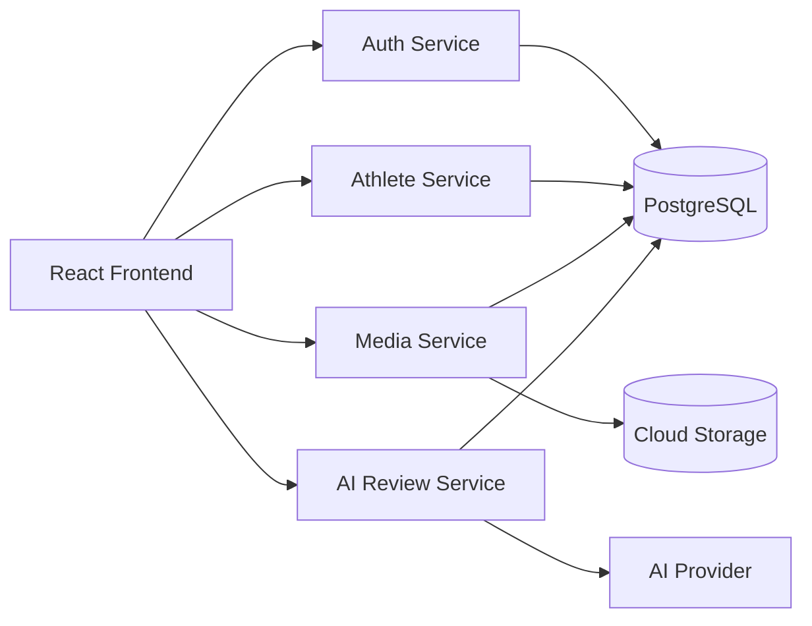

# System Overview Diagram

## High-Level Architecture Diagram

## Frontend

React/Vite app used by coaches and later athletes.

## Backend Services

FastAPI services split by auth, athletes, media, and AI review.

## PostgreSQL

Primary relational data store for users, athletes, sessions, metadata, reviews, and assignments.

## Cloud Storage

Stores uploaded videos and generated media artifacts.

## AI Provider

External AI API used for MVP review generation.
