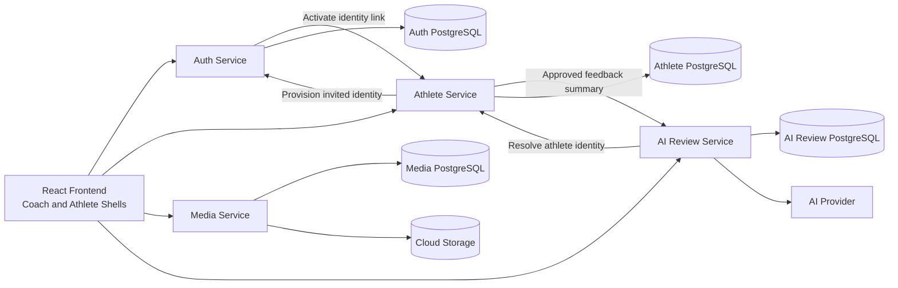

# System Overview Diagram

## High-Level Architecture Diagram

## Frontend

React/Vite app with separate role-aware coach and athlete routes, layouts, navigation, and typed API modules.

## Backend Services

FastAPI services split by auth, athletes, media, and AI review.

## PostgreSQL

Each service owns its PostgreSQL tables and Alembic migrations. External service identifiers are stored as values without cross-database foreign keys.

## Cloud Storage

Stores uploaded videos and generated media artifacts.

## AI Provider

External AI API used for MVP review generation.
